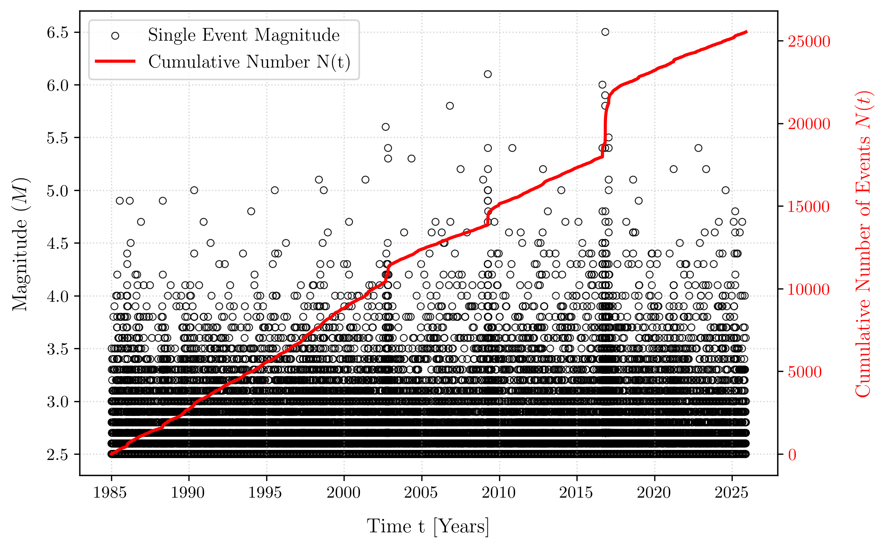
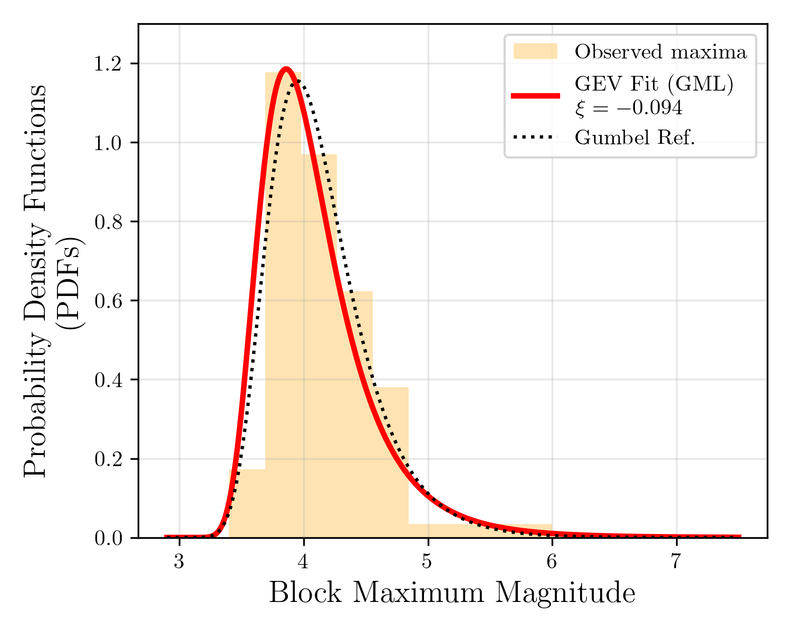
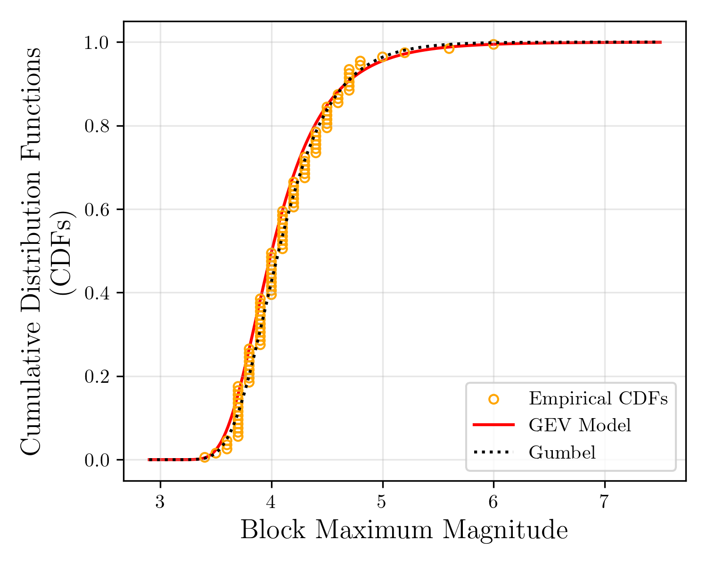
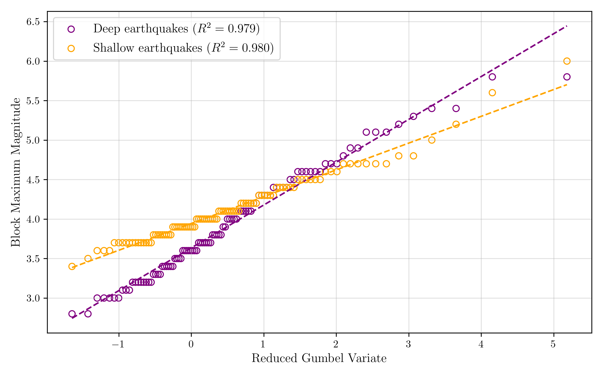
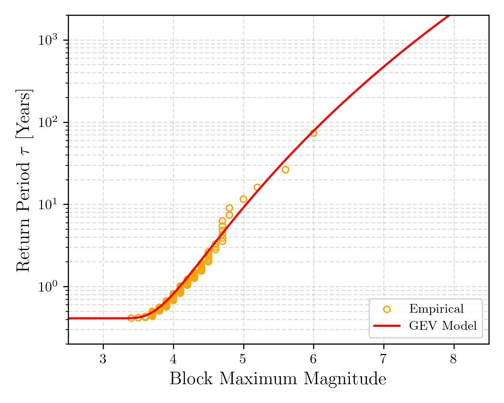
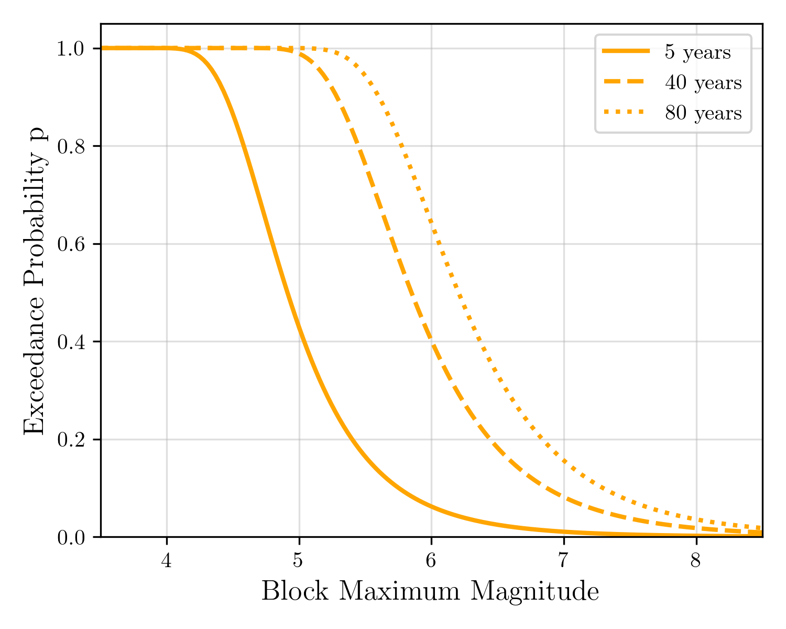
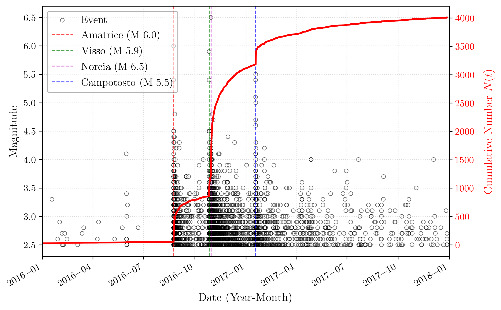
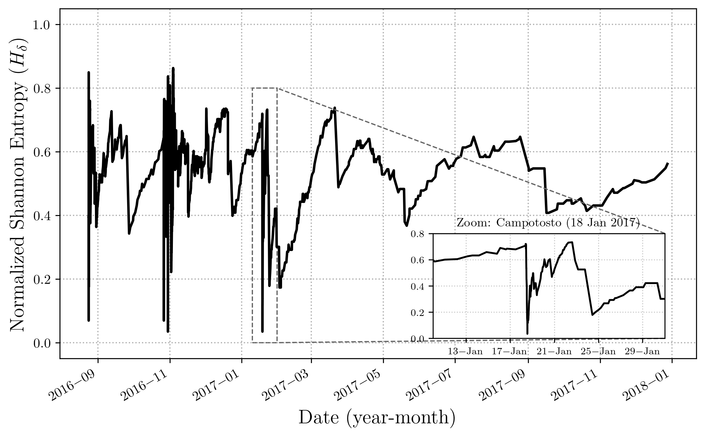
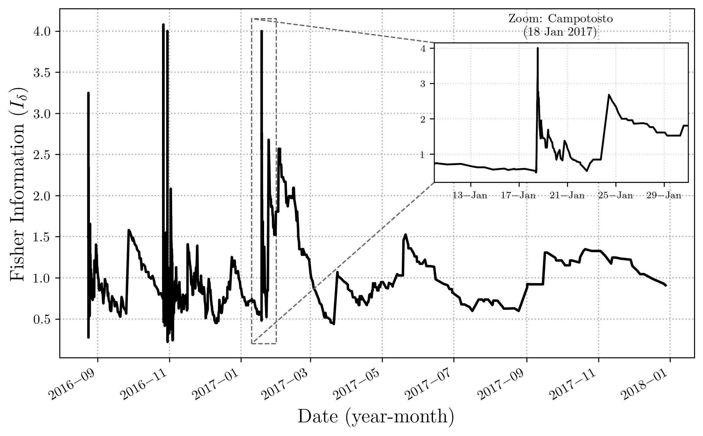
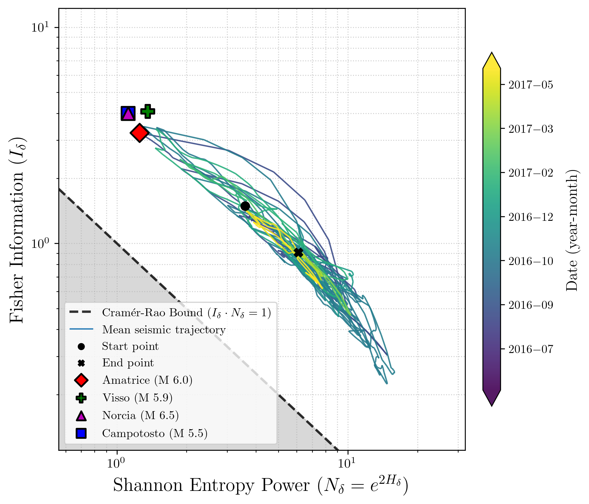

# Statistical Analysis of Italian Seismic Data: Extreme Value Theory & Information Dynamics

Personal project developed for the *Advanced Statistics* exam within the Master's Degree program in **Physics of Complex Systems and Big Data**.

## 🎯 Project Objective
This project analyzes the seismicity of Central-Southern Italy by applying advanced statistical tools to the earthquake catalog provided by the *Istituto Nazionale di Geofisica e Vulcanologia* (INGV). 

The study is divided into two main parts:
1. **Seismic Hazard Assessment:** Modeling extreme seismic events using Extreme Value Theory (EVT) to estimate return periods and exceedance probabilities.
2. **Seismic Dynamics:** Investigating the temporal evolution and correlations of seismic swarms (specifically the 2016-2017 Amatrice sequence) using Information Theory tools.

## 📊 Dataset & Pre-processing
The dataset comprises seismic events in Central-Southern Italy from 1985 to 2025. To ensure statistical reliability and physical correctness, a rigorous pre-processing pipeline was applied:
* **Completeness Filtering:** Events with magnitude $M < 2.5$ were discarded to adhere to the Gutenberg-Richter law.
* **Depth Segmentation:** The catalog was split into Shallow ($d \le 70$ km) and Deep ($d > 70$ km) subsets.
* **Declustering:** The Gardner-Knopoff algorithm was applied to remove aftershocks and dependent events, ensuring the Independent and Identically Distributed (i.i.d.) assumption required for EVT.

## 📈 Phase 1: Extreme Value Theory (EVT)
The first part of the study focuses on the **Block Maxima Method**. By fitting the Generalized Extreme Value (GEV) distribution to the declustered seismic maxima using L-Moments and Generalized Maximum Likelihood (GML), we estimated the shape ($\xi$), location ($\mu$), and scale ($\sigma$) parameters. 

The results yielded a negative shape parameter ($\xi < 0$), suggesting that the extreme value distribution falls within the basin of attraction of a **Weibull distribution**. This implies the existence of a physical upper bound for the maximum possible earthquake magnitude in the region.

### GEV Model Fits and Validation (Shallow Earthquakes)

### Return Period & Seismic Risk (Exceedance Probability)
Based on the GEV fit, I calculated the expected Return Periods ($\tau$) for extreme magnitudes and the Exceedance Probability over specific time horizons (e.g., 5, 40, and 80 years).

## 🧠 Phase 2: Information Dynamics (Amatrice Swarm 2016-2017)
The second part investigates the temporal correlations during the 2016-2017 Central Italy seismic swarm (Amatrice - Visso - Norcia - Campotosto). Rather than treating earthquakes as purely random Poisson processes, I analyzed the system's order-disorder transitions.

I used moving windows to compute two key metrics over the inter-event times ($\Delta t$):
* **Shannon Entropy ($H$):** To measure the degree of disorder and uncertainty in the seismic sequence.
* **Fisher Information ($I$):** To quantify the local predictability and internal organization of the system.

### The Fisher-Shannon Power Plane
By plotting the Shannon Entropy Power ($N_x$) against the Fisher Information ($I$), I mapped the dynamic trajectory of the seismic swarm. 
The system normally resides in a disordered state (high entropy, low Fisher information). However, during the mainshocks, the trajectory violently shifts toward the **Cramér-Rao bound**, signifying a sudden drop in uncertainty and a high degree of organization (strong temporal correlation between events), before slowly relaxing back to the background noise level.

## 🛠️ Tech Stack
* **Language:** Python
* **Main Libraries:** `NumPy`, `SciPy` (stats, optimize), `Pandas`, `Matplotlib`, `GeoPandas`, `Contextily`, `Numba` (for optimized block maxima computation), `statsmodels`.